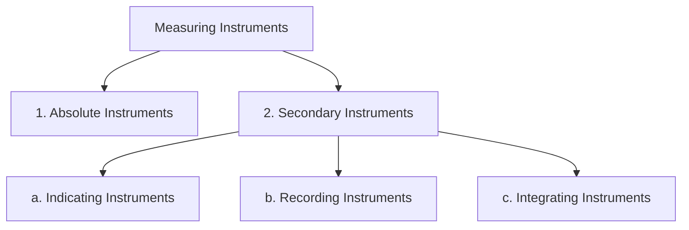

# **Module 1: Introduction to Measurements and Sensors**

## **1.1 Introduction to Instruments: Classifications & Applications**

### **1. Measurement Systems**

A **Measurement System** is a collection of elements used to measure physical and electrical quantities like mass, temperature, pressure, voltage, and current.

*   **Core Purpose:** To provide a numerical value corresponding to the variable being measured.
*   **Broader Applications:** Beyond simple measurement, these systems can be designed for:
    *   **Locating Events:** Pinpointing the epicenter of an earthquake, finding a partial discharge in a power cable.
    *   **Discriminating and Counting:** Counting red blood cells, or fish of a certain size.
*   **Role in Control Systems:** Measurement is fundamental to control. The axiom *"if you can't measure it, you can't control it"* is a key principle for both instrumentation and control engineers.

### **2. Measuring Instruments**

A **Measuring Instrument** is a device used to measure a physical quantity. It provides a way to obtain and compare physical quantities of real-world objects and events.

#### **Key Distinction: Sensor vs. Transducer**

It's important to understand these foundational terms:

| Term | Definition | Examples |
| :--- | :--- | :--- |
| **Transducer** | A device that **converts one form of energy into another**. | Thermocouple (converts heat energy to electrical energy), Microphone (converts sound energy to electrical energy). |
| **Sensor** | A device that **detects a specific physical input** and responds by converting it into a **measurable output signal** (usually electrical). A sensor is often a type of transducer. | Barometer (detects pressure), Accelerometer (detects motion/acceleration). |

[Click here to see a diagram illustrating the difference between a sensor and a transducer](https://www.google.com/search?tbm=isch&q=sensor+vs+transducer+diagram)

---

### **3. Classification of Measuring Instruments**

Measuring instruments are broadly classified into two main categories, with the second category having further sub-divisions.

#### **1. Absolute Instruments**

These instruments give the value of the quantity being measured in terms of the instrument's physical constants and its deflection.

*   **Working Principle:** They do **not** give a direct reading. A mathematical calculation based on the instrument's constants is required to determine the measured value.
*   **Calibration:** They do not need to be calibrated or compared with any other standard instrument.
*   **Application:** They are not used for general measurement due to their complexity. They are primarily used in **standard laboratories** as **standardizing instruments** for calibrating or verifying other instruments.
*   **Examples:**
    *   **Tangent Galvanometer:** Measures current based on the tangent of the angle of deflection, the Earth's magnetic field, and the physical constants of the coil. [Click here for a figure of a Tangent Galvanometer](https://www.google.com/search?tbm=isch&q=tangent+galvanometer)
    *   **Rayleigh's Current Balance**

#### **2. Secondary Instruments**

These are the most common type of instruments. They are designed to give a direct reading of the quantity being measured.

*   **Working Principle:** The value of the quantity is indicated directly by the deflection of a pointer over a pre-calibrated scale.
*   **Calibration:** They must be calibrated by comparison with either an absolute instrument or another secondary instrument that has already been accurately calibrated.
*   **Application:** Used in all day-to-day measurement applications.
*   **Examples:** Voltmeter, ammeter, pressure gauge, glass thermometer, wattmeter.

Secondary instruments are further classified into three types based on how they present the measurement:

##### **a) Indicating Instruments**

These instruments display the **instantaneous value** of the quantity being measured at the time of measurement.

*   **Mechanism:** They use a pointer that moves over a calibrated scale. [Click here for a figure of an indicating instrument (analog voltmeter)](https://www.google.com/search?tbm=isch&q=analog+voltmeter)
*   **Application:** Used whenever the current value of a quantity is needed.
*   **Examples:**
    *   Ammeter (shows current flowing *right now*)
    *   Voltmeter (shows voltage *right now*)
    *   Wattmeter (shows power consumption *right now*)

##### **b) Recording Instruments**

These instruments provide a **continuous record** of the variation of a quantity over a specific period.

*   **Mechanism:** In principle, they are indicating instruments with a recording mechanism attached (e.g., a pen and a moving chart). This creates a permanent, continuous graphical record of the measurement against time. [Click here for a figure of a recording instrument (strip chart recorder)](https://www.google.com/search?tbm=isch&q=strip+chart+recorder)
*   **Application:** Used where it is necessary to monitor and store the trend of a quantity over time.
*   **Examples:**
    *   **ECG (Electrocardiogram) Machine:** Records the electrical activity of the heart over time.
    *   **Potentiometric Recorder:** Used for monitoring and recording temperature on a strip chart.
    *   **Recording Voltmeter:** Records voltage fluctuations in a power line over a 24-hour period.

##### **c) Integrating Instruments**

These instruments measure and register the **total quantity** of a measurand (like energy or electricity) consumed over a specified period.

*   **Mechanism:** They continuously sum up the quantity over time. They give a total reading for a period but do not indicate the instantaneous rate.
*   **Application:** Used where the total consumption or summation of a value over time is required.
*   **Examples:**
    *   **Energy Meter:** Measures total electrical energy (in kWh) consumed by a household over a month. [Click here for a figure of an integrating instrument (analog electricity meter)](https://www.google.com/search?tbm=isch&q=analog+electricity+meter)
    *   **Ampere-hour Meter:** Measures total charge passed through.
    *   **Kilovolt Ampere Hour Meter.**

---

### **Relevant Questions from Question Bank**

Here are answers to questions from your question bank that relate to this section.

**Q1. Differentiate between absolute instruments and secondary instruments with examples.**

| Feature | Absolute Instruments | Secondary Instruments |
| :--- | :--- | :--- |
| **Output** | Gives the value in terms of physical constants and deflection. Requires calculation. | Gives a direct reading of the value on a pre-calibrated scale. |
| **Calibration** | Does not require calibration. It is a primary standard itself. | Must be calibrated against an absolute instrument or a known standard. |
| **Complexity** | Complex to use and requires skilled operation. | Simple and easy to use for direct measurements. |
| **Application** | Used in standard labs for calibration and research. | Used for all general and industrial measurement purposes. |
| **Examples** | Tangent Galvanometer, Rayleigh's Current Balance. | Voltmeter, Ammeter, Wattmeter, Energy Meter. |

**Q2. How is an integrating instrument different from a recording instrument? Give examples of both.**

| Feature | Recording Instrument | Integrating Instrument |
| :--- | :--- | :--- |
| **Function** | Records the **instantaneous value** of a quantity continuously over time. | Measures the **total amount** of a quantity consumed or accumulated over a period. |
| **Output** | A graph or chart showing the variation of the quantity vs. time (e.g., a waveform). | A single numerical value representing the total sum over the period. |
| **Information Provided** | Shows *how* the value changed over time (rate of change, peaks, troughs). | Shows *how much* was used in total over the period. |
| **Examples** | ECG machine, Strip-chart temperature recorder. | Household energy meter, Ampere-hour meter. |

**Q23. Explain the detailed classification and sub-classification of measuring instruments. Give examples of each.**

Measuring instruments are classified as follows:

1.  **Absolute Instruments:**
    *   **Description:** Measure a quantity based on the instrument's physical constants and deflection, requiring calculation. They are primary standards.
    *   **Examples:** Tangent Galvanometer, Rayleigh's Current Balance.

2.  **Secondary Instruments:**
    *   **Description:** Give a direct reading of the quantity. They are pre-calibrated against a standard.
    *   **Examples:** Voltmeter, Thermometer.
    *   **Sub-classifications:**
        *   **a) Indicating Instruments:** Show the value at the instant of measurement.
            *   **Examples:** Ammeter, Voltmeter, Wattmeter.
        *   **b) Recording Instruments:** Provide a continuous graphical record of the quantity's variation over time.
            *   **Examples:** ECG Machine, Temperature Chart Recorder.
        *   **c) Integrating Instruments:** Measure the total consumption or accumulation of a quantity over a period.
            *   **Examples:** Energy Meter (kWh meter), Ampere-hour Meter.
